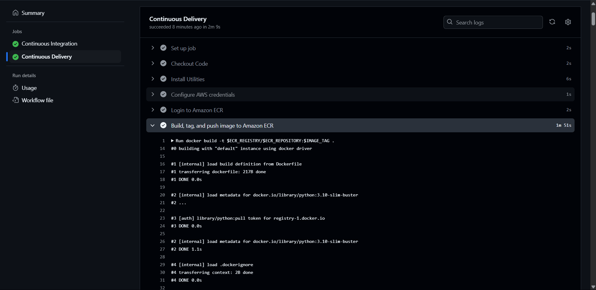

---

# 🛡️ End-to-End AI Phishing Detection System

This repository contains a full-stack, AI-driven phishing detection pipeline. It includes data ingestion, transformation, model training and deployment using AWS services. The pipeline is designed for reliability and scalability, leveraging cloud tools like AWS S3, EC2, and ECR, with training logs tracked through MLflow on DagsHub and MongoDB for persistent storage.

---

## 📂 Project Structure

```
.
├── app.py                     # Streamlit or Flask app entry point
├── main.py                   # Entry to start the training pipeline
├── final_model/              # Stores final model and preprocessor
├── Artifacts/                # Versioned training artifacts
├── logs/                     # Auto-generated logs
├── networksecurity/          # Core package for training and pipeline logic
│   ├── components/           # Contains modules like ingestion, validation, transformation, training
│   ├── pipeline/             # Training pipeline execution script
│   ├── cloud/                # AWS sync utilities
│   ├── utils/                # Utility modules (ML, metrics, etc.)
├── templates/                # Web templates (e.g., for Flask)
├── images/                   # Static images used in the app or for visualization
├── giffer.py                 # GIF creation script from images
├── slider.gif                # Combined visualization from phishing detection outputs
├── push_data.py              # Script to push data to MongoDB
├── requirements.txt          # Python dependencies
├── Dockerfile                # Docker setup for containerization
├── .env                      # Environment credentials (not committed)
```

---

## 🚀 Installation & Setup

### 1️⃣ Clone the Repository

```bash
git clone https://github.com/SiddharthKarmokar/NetworkSecurity.git
cd NetworkSecurity
```

### 2️⃣ Create and Activate Environment (Recommended)

```bash
python -m venv venv
source venv/bin/activate  # macOS/Linux
venv\Scripts\activate     # Windows
######or######
conda create -p venv -y
conda activate ./venv
```

### 3️⃣ Install Dependencies

```bash
pip install -r requirements.txt
```

### 4️⃣ Configure Environment Variables

Create a `.env` file and add:

```env
MONGO_DB_URL="your_mongodb_url"
```

---

## ⚙️ Training and Evaluation Pipeline

The model is selected using `GridSearchCV` across multiple ML classifiers:

- `LogisticRegression`
- `DecisionTreeClassifier`
- `KNeighborsClassifier`
- `RandomForestClassifier`
- `AdaBoostClassifier`
- `GradientBoostingClassifier`

Training metrics are logged with **MLflow** and tracked via **DagsHub**.

To start local host:
```bash
python app.py #default to port 8000
python -m http.server 8080
```

---

## 📦 Deployment

The trained model and preprocessor are:

- **Stored on AWS S3**
- **Hosted via Dockerized API on EC2 using ECR**

To build and push Docker image:

```bash
docker build -t phishing-detector .
docker tag phishing-detector:latest <your_aws_repo>:latest
docker push <your_aws_repo>:latest
```

---

## 🖼 Visualization

All results, including phishing detection insights, are visualized. GIFs of predictions and analyses are saved in `slider.gif`.

### 🖼 Preview:
---

---

## 🤝 Contributions

Pull requests, issue reports, and suggestions are welcome!

### 👤 Author
- Siddharth Karmokar

---